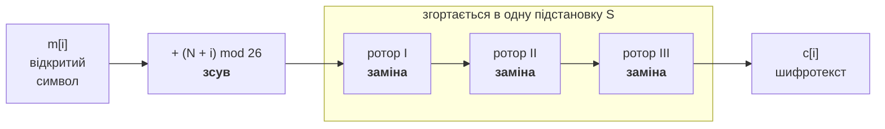
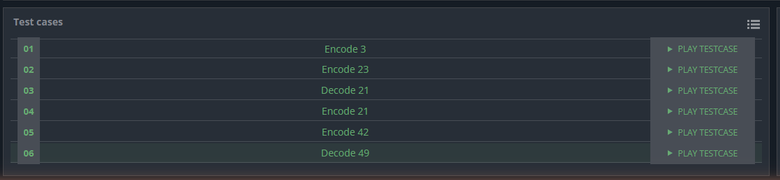
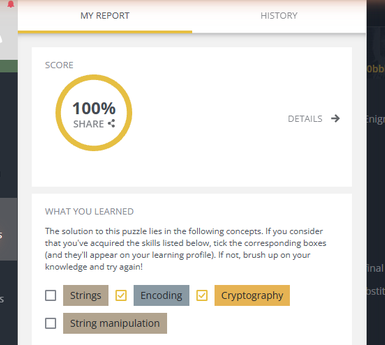
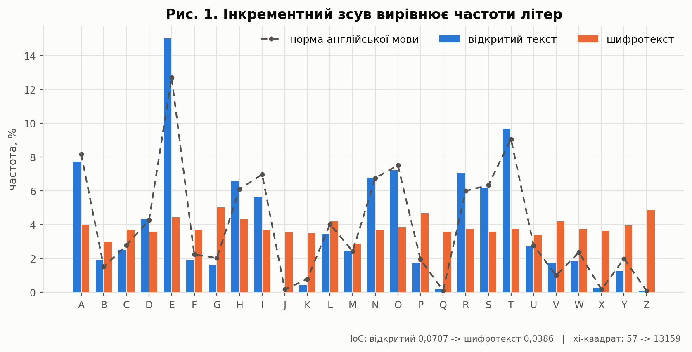
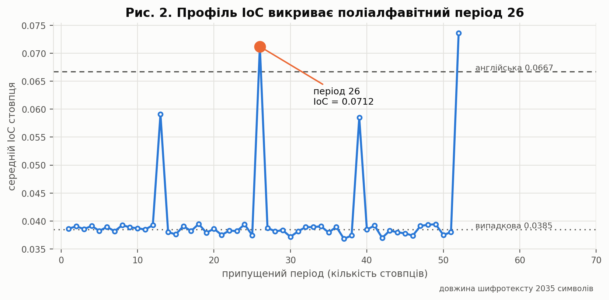
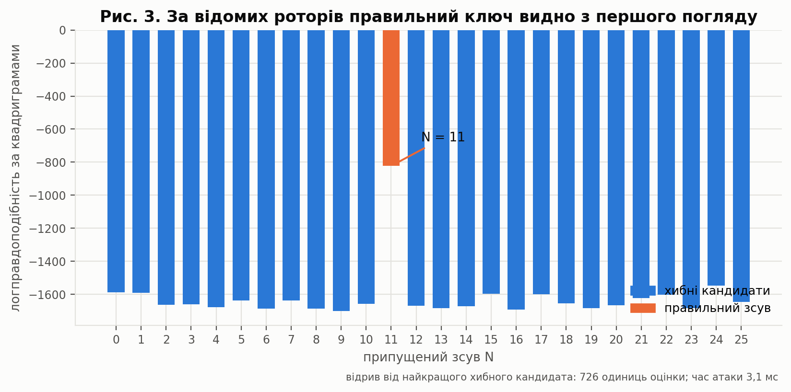
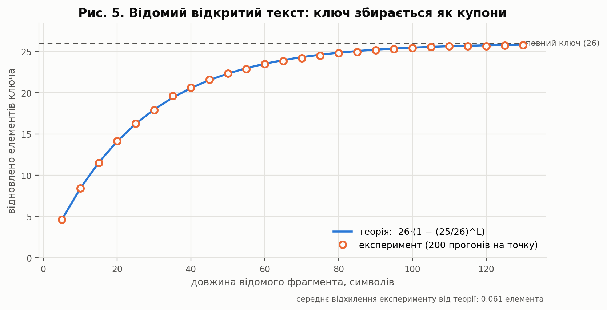
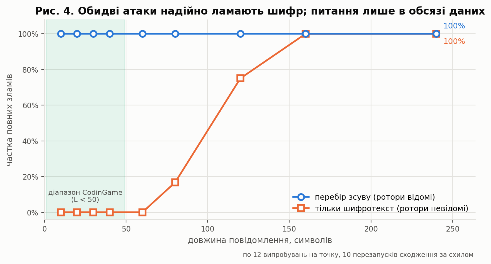
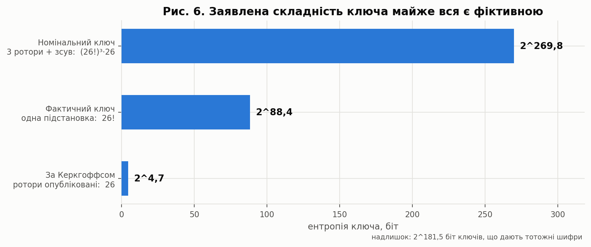
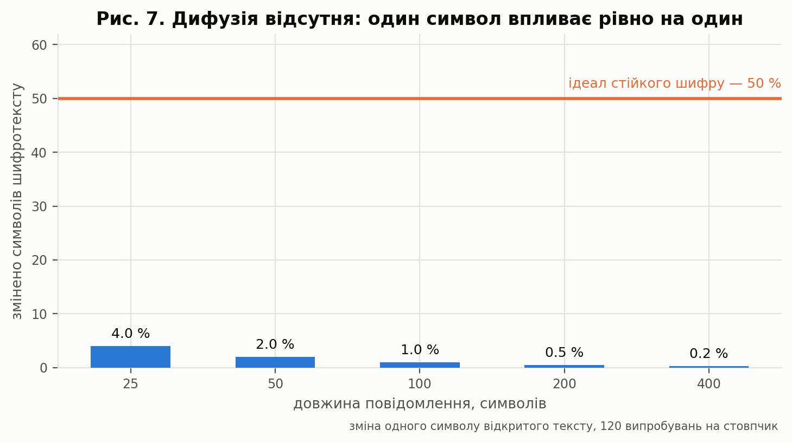

<h1 align="center">Лабораторна робота №2</h1>
<h3 align="center">Шифрування та розшифрування на машині «Енігма»<br>і повний криптоаналіз шифру</h3>

<p align="center">
  <a href="https://github.com/RE22GDV/LR2-Enigma/actions/workflows/ci.yml"></a>
  
  
  
  
  
</p>

> **Дисципліна:** Захист даних &nbsp;·&nbsp; **Тема:** криптографічні примітиви перестановки та заміни
> **Задача:** [CodinGame — Encryption/Decryption of Enigma Machine](https://www.codingame.com/training/easy/encryptiondecryption-of-enigma-machine) (Easy)

---

## Зміст

1. [Мета та постановка задачі](#1-мета-та-постановка-задачі)
2. [Математична модель шифру](#2-математична-модель-шифру)
3. [Структура репозиторію](#3-структура-репозиторію)
4. [Швидкий старт](#4-швидкий-старт)
5. [Верифікація рішення](#5-верифікація-рішення)
6. [Криптоаналіз](#6-криптоаналіз)
7. [Порівняння зі справжньою «Енігмою»](#7-порівняння-зі-справжньою-енігмою)
8. [Висновки](#8-висновки)
9. [Відтворення результатів](#9-відтворення-результатів)
10. [Джерела](#10-джерела)

---

## 1. Мета та постановка задачі

**Мета роботи** — реалізувати шифр, побудований на двох базових криптографічних
примітивах, та оцінити його криптографічну стійкість експериментально.

У задачі поєднано обидва класичні примітиви в чистому, незамаскованому вигляді:

| Примітив | Втілення в задачі | Класичний аналог |
|---|---|---|
| **Зсув (перестановка алфавіту)** | шифр Цезаря з інкрементним ключем: `i`-й символ зсувається на `N + i` | шифр Цезаря, шифр Віженера |
| **Заміна (підстановка)** | три ротори — три довільні таблиці заміни алфавіту | моноалфавітна заміна |

### Постановка (за умовою CodinGame)

**Вхід**

```
рядок 1    ENCODE | DECODE
рядок 2    початковий зсув N,  0 ≤ N < 26
рядки 3-5  три ротори по 26 великих латинських літер
рядок 6    повідомлення,  1 ≤ довжина < 50,  лише A..Z
```

**Вихід** — зашифроване або розшифроване повідомлення.

### Приклад із умови, розібраний покроково

```
AAA  ──зсув N=4, 5, 6──▶  EFG  ──ротор I──▶  JLC  ──ротор II──▶  BHD  ──ротор III──▶  KQF
```

Цей ланцюжок перевіряється окремим тестом
[`test_statement_example_step_by_step`](tests/test_core.py) — кожен проміжний
стан зафіксовано, а не лише кінцевий результат.

---

## 2. Математична модель шифру

### 2.1 Пряме та зворотне перетворення

Позначимо літери числами `0..25` (A = 0). Нехай `R₁, R₂, R₃` — підстановки
роторів, `N` — початковий зсув, `m` — відкритий текст, `c` — шифротекст.

```
                 ┌─── перестановка ───┐   ┌───────── заміна ─────────┐
    c[i]  =  S[ (m[i] + N + i) mod 26 ],      S = R₃ ∘ R₂ ∘ R₁
    m[i]  =  ( S⁻¹[c[i]] − N − i ) mod 26
```



### 2.2 Три спостереження, на яких тримається вся робота

> **Спостереження 1. Три ротори — це один ротор.**
> Композиція бієкцій — знову бієкція, тож `S = R₃ ∘ R₂ ∘ R₁` є однією
> підстановкою. Каскад із `k` роторів не дає нічого, чого не дав би один.
> Це не здогад: метод `EnigmaMachine.equivalent_single_rotor()` будує
> еквівалентну машину з **одним** ротором і **нульовим** зсувом, а тест
> [`test_three_rotors_collapse_to_one`](tests/test_core.py) перевіряє
> побітову рівність шифротекстів на 50 випадкових конфігураціях.

> **Спостереження 2. Шифр поліалфавітний із періодом рівно 26.**
> На позиції `i` застосовується алфавіт `A_p`, де `p = (N + i) mod 26`,
> причому `A_p(m) = S[(m + p) mod 26]`. Усі 26 алфавітів породжені однією
> підстановкою `S`, тож реалізація зберігає їх як 26 готових таблиць —
> внутрішній цикл шифрування не містить жодної арифметики.

> **Спостереження 3. Увесь ключ стискається до 26 чисел.**
> Введемо **ефективний ключ** `D[x] = (S⁻¹[x] − N) mod 26`. Тоді
> ```
>     m[i] = ( D[c[i]] − i ) mod 26
> ```
> Це повний опис шифру: зсув `N` «втоплено» в підстановку. Саме `D`
> відновлюють усі чотири реалізовані атаки, і саме тому фактична
> стійкість дорівнює `26!`, а не `(26!)³ · 26`.

### 2.3 Складність

| Величина | Значення |
|---|---|
| Час шифрування | `O(L + 26k)` — `k` роторів згортаються один раз, далі одне звертання до таблиці на символ |
| Додаткова пам'ять | `O(26²)` на таблиці алфавітів (676 байт), незалежно від довжини повідомлення |
| Час розшифрування | ідентичний — операція строго симетрична |

---

## 3. Структура репозиторію

```
LR2_Enigma/
├── solution/
│   └── codingame_solution.py      Рішення, відправлене на CodinGame (100 %)
├── src/enigma/
│   ├── core.py                    Ротор, машина, ефективний ключ
│   ├── rotors.py                  Каталог історичних проводок
│   ├── analysis.py                IoC, хі-квадрат, ентропія, відстань єдиності
│   ├── ngrams.py                  Модель англійської мови (квадриграми)
│   ├── attacks.py                 Чотири атаки + оцінка простору ключів
│   └── cli.py                     Командний інтерфейс
├── csharp/Enigma/                 Незалежна реалізація мовою C# (.NET 8)
├── tests/                         86 тестів, зокрема 6 офіційних із CodinGame
├── experiments/run_experiments.py Усі обчислювальні експерименти та рисунки
├── tools/build_ngrams.py          Побудова мовної моделі з корпусу
├── data/                          Модель мови + текст для експериментів
├── tools/build_report.py          Генератор звіту (PDF і DOCX з одного джерела)
└── docs/
    ├── ЛР_2_...РС-61мн.pdf/.docx  Звіт, 20 стор. (генерується скриптом)
    ├── figures/                   Рисунки (+ pdf/ — версії без заголовків)
    └── results/                   experiments.json, summary.md
```

**Ядро шифру та всі атаки не мають зовнішніх залежностей** — лише стандартна
бібліотека Python. `matplotlib` і `pytest` потрібні виключно для графіків і тестів.

---

## 4. Швидкий старт

```bash
git clone https://github.com/RE22GDV/LR2-Enigma.git
cd LR2-Enigma
```

Прогін офіційних тестів задачі — без встановлення будь-чого:

```bash
python run.py selftest
```

```
[OK] Encode 3    ENCODE -> KQF
[OK] Encode 23   ENCODE -> ALWAURKQEQQWLRAWZHUYKVN
[OK] Decode 21   DECODE -> EVERYONEISWELCOMEHERE
[OK] Encode 21   ENCODE -> PQSACVVTOISXFXCIAMQEM
[OK] Encode 42   ENCODE -> PQSACVVTOISXFXCIAMQEMDZIXFJJSTQIENEFQXVZYV
[OK] Decode 49   DECODE -> THEQUICKBROWNFOXJUMPSOVERALAZYSPHINXOFBLACKQUARTZ
Пройдено 6 з 6
```

Основні команди:

```bash
python run.py encode --shift 4 --message AAA          # -> KQF
python run.py decode --shift 4 --message KQF          # -> AAA
python run.py solve < tests/samples/case1_encode.txt  # формат CodinGame
python run.py rotors                                  # паспорт роторів
python run.py analyze --text "<шифротекст>"           # частоти, IoC, період
python run.py keyspace                                # простір ключів і дифузія
python run.py attack --shift 11 --message "ATTACKATDAWN..."
```

Реалізація мовою C#:

```bash
dotnet run --project csharp/Enigma -- selftest
```

---

## 5. Верифікація рішення

Правильність підтверджено на **чотирьох незалежних рівнях**.

### 5.1 Офіційні валідатори CodinGame

Рішення відправлено на платформу; приховані валідатори пройдено повністю.

| Показник | Значення |
|---|---|
| **Оцінка валідатора** | **100 %** |
| Мова | Python 3 |
| Видимі тести | 6 з 6 |
| Відправлений код | [`solution/codingame_solution.py`](solution/codingame_solution.py), байт-у-байт |





### 5.2 Офіційні тести, зафіксовані в репозиторії

Усі шість тестів платформи (входи **та** еталонні виходи) збережено в
[`tests/official_cases.json`](tests/official_cases.json) і прогоняються
локально й у CI — окремо для бібліотеки та окремо для самодостатнього
файлу рішення через `stdin`/`stdout`.

| № | Тест | Режим | N | Довжина | Результат |
|---|---|---|---:|---:|:-:|
| 1 | Encode 3 | ENCODE | 4 | 3 | ✅ |
| 2 | Encode 23 | ENCODE | 7 | 23 | ✅ |
| 3 | Decode 21 | DECODE | 9 | 21 | ✅ |
| 4 | Encode 21 | ENCODE | 9 | 21 | ✅ |
| 5 | Encode 42 | ENCODE | 9 | 42 | ✅ |
| 6 | Decode 49 | DECODE | 5 | 49 | ✅ |

> **Помічено під час аналізу:** в усіх шести тестах ротори **однакові**.
> Це зафіксовано тестом `test_all_cases_share_the_same_rotors` і має прямі
> криптографічні наслідки — див. §6.4.

### 5.3 Властивісні тести

86 тестів, серед них:

- **оборотність** — `decode(encode(m)) == m` на 300 випадкових конфігураціях;
- **періодичність** — `encode("A"×52)` складається з двох однакових половин;
- **колапс роторів** — 3 ротори + зсув ≡ 1 ротор + нульовий зсув (50 конфігурацій);
- **валідація входу** — некоректні ротори та символи поза `A..Z` відхиляються;
- **модульність зсуву** — `N = 3` і `N = 29` дають однаковий результат;
- **некомутативність** — порядок роторів впливає на результат.

### 5.4 Перехресна перевірка двох реалізацій

Незалежна реалізація мовою **C#** проходить ті самі шість тестів і
2000 перевірок оборотності; тест
[`test_python_and_csharp_agree`](tests/test_cross_implementation.py)
порівнює вихід обох реалізацій символ у символ.

```bash
$ python -m pytest -q
86 passed
```

---

## 6. Криптоаналіз

Далі — власне дослідницька частина. Усі числа й рисунки отримано скриптом
[`experiments/run_experiments.py`](experiments/run_experiments.py) із
фіксованими зернами генераторів, тобто відтворюються побітово.

Мовна модель для оцінки «англійськості» тексту — **логправдоподібність за
квадриграмами**, натренована на корпусі **5 623 458 літер** текстів
суспільного надбання (у репозиторії зберігається лише похідна статистика).

### 6.1 Чи працює звичайний частотний аналіз? Ні — і це цікаво



Інкрементний зсув розмазує кожну літеру відкритого тексту по всіх 26 позиціях,
тому розподіл літер шифротексту стає майже рівномірним:

| Величина | Відкритий текст | Шифротекст | Орієнтир |
|---|---:|---:|---|
| Індекс відповідності (IoC) | 0.0707 | **0.0386** | англ. 0.0667 · випадк. 0.0385 |
| Хі-квадрат до англійської | 57 | **13 159** | менше — ближче до мови |
| Ентропія, біт/символ | 4.105 | **4.689** | максимум 4.700 |

Максимальне відхилення частоти будь-якої літери шифротексту від рівномірних
3.85 % становить лише **1.17 в. п.** Класичний частотний аналіз тут безсилий:
шифротекст статистично невідрізнити від випадкового шуму.

**Саме тому наївний висновок «шифр стійкий» і був би помилкою.**

### 6.2 Визначення періоду: шифр викриває сам себе



Розіб'ємо шифротекст на `p` стовпців за індексом `i mod p`. Якщо вгадати
справжній період, кожен стовпець виявиться **моноалфавітною** заміною, а IoC
підскочить до англійського рівня (IoC інваріантний щодо простої заміни).

| Припущений період | Середній IoC стовпця |
|---|---:|
| 1 (весь текст) | 0.0386 — «випадковий» |
| **26** | **0.0712** — англійський рівень |
| кратні 26 (52) | так само високий |
| решта | ≈ 0.038 |

Сплеск рівно на 26 і його кратних — експериментальний доказ Спостереження 2.
Період знайдено **без жодного знання про ротори чи зсув**.

### 6.3 Ієрархія атак

Реалізовано чотири атаки в порядку спадання припущень про можливості
зловмисника. Усі відновлюють один і той самий об'єкт — ефективний ключ `D`.

| Атака | Що знає зловмисник | Вартість | Час | Ключ | Текст |
|---|---|---|---:|:-:|:-:|
| **Перебір зсуву** | ротори | 26 варіантів | 0.007 с | ✅ | ✅ |
| **Відомий відкритий текст** | пару (текст, шифротекст) | 180 символів | < 1 мс | ✅ | ✅ |
| **Підібраний відкритий текст** | доступ до оракула | **1 запит на 26 символів** | < 1 мс | ✅ | ✅ |
| **Тільки шифротекст** | нічого, крім шифротексту | 78 481 оцінка | 3.0 с | ✅ | ✅ |

*Умови: повідомлення 180 символів, `N = 11`, ротори з умови задачі. Таблицю
генерує `experiments/run_experiments.py` (розділ «Зведена таблиця атак»);
інтерактивний варіант — `python run.py attack --shift 11 --message "<текст>"`.*

### 6.4 Атака 1 — перебір зсуву (реалістичний сценарій цієї задачі)



За **принципом Керкгоффса** стійкість має залежати тільки від ключа, а не від
секретності алгоритму. У цій задачі ротори надруковано в умові й вони однакові
в усіх шести тестах — отже, справжній секрет один: зсув `N`.

Це **26 варіантів**, тобто **4.7 біта** ентропії. Перебір завершується за
**2.9 мс**, а правильний кандидат відривається від найкращого хибного на
**726 одиниць** логправдоподібності — сумнівів у відповіді не лишається.
Атака працює на **100 % повідомлень будь-якої довжини**, включно з трисимвольними.

### 6.5 Атака 2 — відомий відкритий текст (задача про збирання купонів)



Кожна відома пара символів дає один елемент ключа **без жодного перебору**:

```
D[c[i]] = (m[i] + i) mod 26
```

Скільки треба відомого тексту? Це класична задача про збирання купонів:
`E[покриття] = 26·(1 − (25/26)^L)`. Експеримент (200 прогонів на точку)
збігається з теорією із середнім відхиленням **0.061 елемента ключа**:

| Довжина фрагмента `L` | 10 | 25 | 50 | 105 |
|---|---:|---:|---:|---:|
| Відновлено елементів (експеримент) | 8.44 | 16.29 | 22.35 | 25.56 |
| Теорія `26·(1 − (25/26)^L)` | 8.44 | 16.25 | 22.34 | 25.58 |

Очікувана довжина, щоб зібрати **всі** 26 елементів, — `26·H₂₆ ≈ 100` символів.
Але повний ключ і не потрібен: навіть половина елементів дозволяє прочитати
більшу частину повідомлення, а решту легко доповнити за контекстом.

### 6.6 Атака 3 — підібраний відкритий текст (один запит)

Найдешевша атака. Надсилаємо оракулу `"AAAA…A"` (26 літер). Тоді
`c[i] = S[(0 + N + i) mod 26]`, а отже

```
D[c[i]] = i
```

Оскільки `S` — бієкція, усі 26 відповідей різні, і **весь ключ відновлюється
з одного запиту завдовжки 26 символів**. Ані ротори, ані зсув знати не треба.
Перевірено на 25 випадкових конфігураціях у
[`test_chosen_plaintext_needs_exactly_one_query`](tests/test_attacks.py).

### 6.7 Атака 4 — тільки шифротекст (головний результат)



Найслабші припущення: зловмисник не знає **ні роторів, ні зсуву** — лише
шифротекст. Ключова ідея: позиційний зсув `−i` є **публічною структурою, а не
секретом**, тож вгадувати треба єдину бієкцію `D`. Задача зводиться до
звичайної моноалфавітної заміни.

Реалізовано **сходження за схилом по квадриграмах** із жадібною частотною
ініціалізацією: для кожної пари (літера шифротексту, кандидат) оцінюється
частотна правдоподібність породжених символів, далі пари розбираються жадібно
зі збереженням бієктивності, а потім ключ уточнюється випадковими обмінами.

| Довжина повідомлення | 10–60 | 80 | 120 | 160 | 240 |
|---|---:|---:|---:|---:|---:|
| Частка повних зламів | 0 % | 17 % | 75 % | **100 %** | **100 %** |
| Середній час атаки | < 0.4 с | 0.5 с | 0.8 с | 1.2 с | 1.5 с |

**Інтерпретація порогу.** Відстань єдиності Шеннона для ключа `26!`:

```
U = H(K) / D = 88.4 / (4.70 − 1.5) ≈ 28 символів
```

Тобто коротші за ~28 символів шифротексти в принципі мають кілька осмислених
розшифрувань — їх не зламає **жоден** алгоритм. Наш практичний поріг (~120–160
символів) у 4–6 разів вищий: це типовий розрив між інформаційно-теоретичною
межею та можливостями конкретного евристичного алгоритму.

> **Наслідок для умови задачі.** CodinGame обмежує повідомлення 50 символами.
> Саме в цьому діапазоні ціліснотекстова атака ще не спрацьовує надійно — але
> атака §6.4 (ротори ж відомі!) ламає **100 %** таких повідомлень за мілісекунди.

### 6.8 Оцінка простору ключів: скільки з нього справжнього



| Модель | Простір ключів | Ентропія |
|---|---|---:|
| Номінально: 3 ротори + зсув | `(26!)³ · 26` | **2^269.8** |
| Фактично: одна підстановка `D` | `26!` | **2^88.4** |
| За Керкгоффсом: ротори опубліковано | `26` | **2^4.7** |

Заявлені 269.8 біта — здебільшого фікція: **2^181.5** різних наборів
(ротори + зсув) дають **тотожні** шифротексти. Це не викладка на папері —
функція `find_key_collision()` конструктивно будує два різні ключі, які
збігаються символ у символ на 120 випадкових літерах:

```bash
python run.py keyspace
```

### 6.9 Дифузія: її просто немає



Для стійкого шифру зміна одного біта відкритого тексту має змінювати
≈ 50 % шифротексту (строгий лавинний критерій). Вимірювання (120 випробувань
на точку):

| Довжина повідомлення | 25 | 50 | 100 | 200 | 400 |
|---|---:|---:|---:|---:|---:|
| Змінено символів шифротексту | 1 | 1 | 1 | 1 | 1 |
| Частка | 4.0 % | 2.0 % | 1.0 % | 0.5 % | **0.25 %** |

Змінюється **рівно один** символ — завжди. Кожен символ шифрується незалежно
від решти, дифузія відсутня повністю. Практичний наслідок: зловмисник може
редагувати шифротекст посимвольно, а часткове знання ключа дає частковий
відкритий текст без жодного «розсипання» решти.

---

## 7. Порівняння зі справжньою «Енігмою»

Під час роботи виявлено цікавий факт: **ротори з умови задачі — це справжні
проводки Enigma I (Wehrmacht, 1930), перелічені у зворотному порядку.**

| У задачі | Проводка | Історичний ротор |
|---|---|---|
| ROTOR I | `BDFHJLCPRTXVZNYEIWGAKMUSQO` | Enigma I, **Rotor III** |
| ROTOR II | `AJDKSIRUXBLHWTMCQGZNPYFVOE` | Enigma I, **Rotor II** |
| ROTOR III | `EKMFLGDQVZNTOWYHXUSPAIBRCJ` | Enigma I, **Rotor I** |

Перевіряється командою `python run.py rotors`.

Проте це **не** машина Енігма, а її суттєво спрощена модель:

| Властивість | Справжня Enigma I | Модель із задачі |
|---|---|---|
| Обертання роторів | так, після кожного символу | **ні**, ротори нерухомі |
| Період | 26 × 25 × 26 = **16 900** | **26** |
| Рефлектор | так (UKW-B/C) | немає |
| Комутаційна панель | так, 10 пар кабелів | немає |
| Вибір і порядок роторів | 3 з 5, `5·4·3 = 60` варіантів | задано входом |
| Початкові положення | 26³ = 17 576 | один зсув, 26 |
| Ефективний ключ | ≈ 2^76 (з комутаційною панеллю) | **2^88.4** номінально, **2^4.7** у задачі |
| Самошифрування літери | **неможливе** (вада рефлектора!) | можливе |

Парадокс, який варто підкреслити: за «сирим» розміром ключа спрощена модель
виглядає **сильнішою** за історичну Енігму. Але історичну машину ламали саме
через її структурні вади (рефлектор і те, що літера ніколи не переходила
сама в себе), а цю модель — через відсутність руху роторів, що перетворює
її на моноалфавітну заміну з публічною надбудовою. **Розмір ключа сам по собі
нічого не гарантує** — це, мабуть, головний практичний висновок роботи.

---

## 8. Висновки

1. **Задачу розв'язано повністю**: оцінка валідаторів CodinGame — **100 %**,
   усі 6 офіційних тестів пройдено, реалізацію продубльовано двома мовами
   (Python і C#) і покрито **86 тестами**.

2. **Алгоритм оптимізовано структурно, а не мікрооптимізаціями**: розуміння
   того, що композиція роторів є однією підстановкою, дає `O(L)` без
   арифметики у внутрішньому циклі.

3. **Два примітиви, ужиті нарізно, не додаються, а майже не взаємодіють.**
   Заміна дає `26!` варіантів, зсув — `26`, але оскільки зсув детермінований і
   публічний, сумарна стійкість дорівнює стійкості **однієї** заміни.

4. **Заявлений простір ключів `2^269.8` фактично дорівнює `2^88.4`**, а в умовах
   задачі (опубліковані ротори) — **`2^4.7`**. Надлишок у `2^181.5` ключів
   доведено конструктивно побудованою колізією.

5. **Шифр зламується в усіх чотирьох моделях атак**, зокрема в найслабшій —
   лише за шифротекстом, без будь-якого знання ключа, за ~1 секунду для
   повідомлень від 160 символів.

6. **Головна вада — нерухомі ротори.** Саме рух роторів робив історичну Енігму
   поліалфавітним шифром із періодом 16 900; без нього лишається моноалфавітна
   заміна, замаскована передбачуваним зсувом.

7. **Практичний урок:** висока ентропія шифротексту (4.689 з 4.700 біт) і
   «випадковий» вигляд частот **не є доказом стійкості**. Стійкість визначає
   структура ключа, а не зовнішній вигляд виходу.

---

## 9. Відтворення результатів

```bash
# 1. Тести (86 шт.)
python -m pytest -q

# 2. Офіційні тести CodinGame
python run.py selftest
dotnet run --project csharp/Enigma -- selftest

# 3. Усі експерименти, числа та рисунки (~60 с)
pip install -r requirements.txt
python experiments/run_experiments.py
#   -> docs/figures/*.png
#   -> docs/results/experiments.json, summary.md

# 4. Перебудова мовної моделі з корпусу (потрібен інтернет; результат уже в data/)
python tools/build_ngrams.py

# 5. Складання звіту (потрібні reportlab, python-docx і шрифти Times New Roman / Courier New)
python tools/build_report.py                  # обидва формати
python tools/build_report.py --format docx    # лише DOCX
#   -> docs/ЛР_2_Гандзюк_Дмитро_РС-61мн.pdf
#   -> docs/ЛР_2_Гандзюк_Дмитро_РС-61мн.docx
```

Усі генератори псевдовипадкових чисел ініціалізуються фіксованими зернами,
тому повторний запуск дає ті самі числа.

---

## 10. Джерела

1. CodinGame. *Encryption/Decryption of Enigma Machine* (Easy).
   https://www.codingame.com/training/easy/encryptiondecryption-of-enigma-machine
2. Caesar cipher — Wikipedia. https://en.wikipedia.org/wiki/Caesar_cipher
3. Enigma machine — Wikipedia. https://en.wikipedia.org/wiki/Enigma_machine
4. Enigma rotor details — Wikipedia (історичні проводки роторів).
   https://en.wikipedia.org/wiki/Enigma_rotor_details
5. Index of coincidence — Wikipedia. https://en.wikipedia.org/wiki/Index_of_coincidence
6. C. E. Shannon. *Communication Theory of Secrecy Systems* // Bell System
   Technical Journal, 1949 — відстань єдиності, надлишковість мови.
7. H. Beker, F. Piper. *Cipher Systems: The Protection of Communications*, 1982 —
   еталонні частоти літер англійської мови.
8. Корпус для мовної моделі — тексти суспільного надбання Project Gutenberg
   (у репозиторії зберігається лише похідна статистика n-грам).

---

<p align="center">
  <sub>Лабораторна робота №2 · Захист даних · 2026</sub>
</p>
